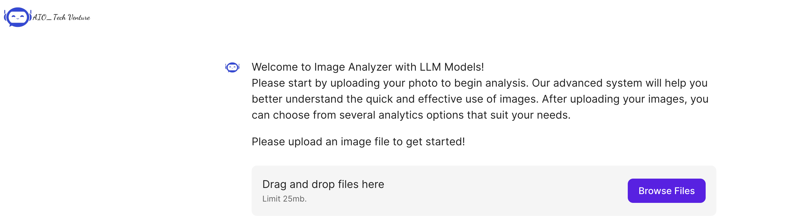

## Agent chatbot: Image Analyzer with LLM
Welcome to Image Analyzer with LLM Models!
Our advanced system will help you better understand the quick and effective use of images. After uploading your images, you can choose from several analytics options that suit your needs. These are 5 keypoints of this agent, otherwise you can ask agent to discover more insight of your image:

1. Detect human and drinker
2. Detect print adversting 
3. Evaluate success event
4. Follow marketing staff
5. Assess retail presence

**1. Clone the repository:**
```bash
git clone https://github.com/NguyenVH01/heineken-agent.git
cd heineken-agent
```

**2. (Optional) Create and activate a virtual environment:**
- For Unix/macOS:
```bash
python3 -m venv .venv
source .venv/bin/activate
```

- For Windows:
```bash
python -m venv venv
.\venv\Scripts\activate
```

**3. Install the required dependencies:**
```bash
pip install -r requirements.txt
```


**Starting the Application**

Once everything is ready, you can launch the application by running:

```bash
chainlit run app.py
```